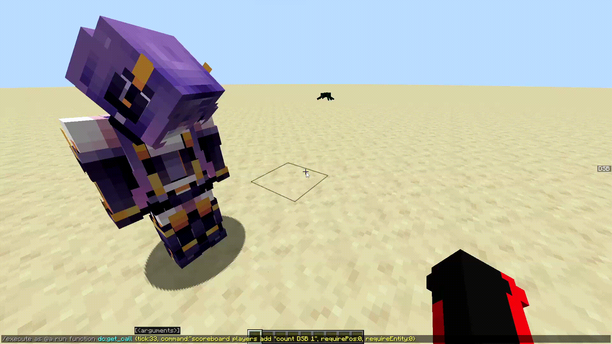

# Delayed Commands datapack
Изначально датапак был сделан для возможности использования команды /schedule от имени игроков. Позже он был расширен и добавлены другие функции.

Пример использования:
```mcfunction
function dc:get_call {tick:30, command:"say Hello World", requirePos:1, requireEntity:0}
```
Если вручную написть команду в чате, то через 1.5 секунды (30 указанных тиков) игрок в чат напишет ***"Hello World"***.

## Установка
- Откройте delayed_commands_pack
- Скачайте в zip формате и распакуйте
- Откройте datapacks в выбранной папке с миром
- Скопируйте распакованный архив в неё
- Откройте мир и пропишите команду `/reload`

## Использование
При запуске команды `dc:get_call`, алгоритм смотрит на то, КТО и ГДЕ запустил эту команду. То есть, если dc:get_call было прописано игроком вручную, в дальнейшем команда может быть выполнена от имени игрока на его позиции. Если же dc:get_call было запущено из файла .mcfunction, то, если команду не выполняет какая-либо сущность, будет запуск будет от имени сервера.

Для начала нужно указать **4 параметра**.
- `tick`. Время в тиках через которое выполнится команда
- `command`. Сама команда, например **"setblock ~ ~ ~ stone"**
- `requirePos`. *true/false (1/0)*. Запоминать ли позицию, в которой был выполнен запрос dc:get_call (далее в примерах)
- `requireEntity`. *true/false (1/0)*. Нужна ли будет сущность для выполнения command. Сущность (или несколько) та, которая является исполнителем команды dc:get_call
___
### Комбинации
Перебор вариантов **requirePos** и **requireEntity** дает нам 4 возможных варианты выполнения команды:
  + ***requirePos:0, requireEntity:1***. Самый часто используемый. Выполнит команду от имени сущности на её актуальной позиции: `execute as $(UUID) at @s`.
   
  + ***requirePos:1, requireEntity:1***. Запоминается позиция (вплоть до измерения) и взгляд сущности в момент запроса dc:get_call. Далее, через заданное время команда выполнится на тех координатах, но от имени сущности: `execute as $(UUID) in $(dimension) positioned $(X) $(Y) $(Z) rotated $(RotationX) $(RotationY)`.
   
  + ***requirePos:1, requireEntity:0***. Тут не важно кто вызвал dc:get_call. Запомнится позиция из которой был сделан запрос, а так же позиция взгляда (если сущности не было, значит будет 0 0). Выполнение команды через время: `execute in $(dimension) positioned $(X) $(Y) $(Z) rotated $(RotationX) $(RotationY)`.
   
  + ***requirePos:0, requireEntity:0***. Пустой запуск. Команда выполняется от имени сервера на нулевых координатах (0 0 0) в overworld. Подходит для различных технических моментов, например переключение gamerule. Команда на исполнение: `execute positioned 0 0 0 run`.

## Примеры
### 1.
```mcfunction
execute as @a run function dc:get_call {tick:50, command:"setblock ~ ~1 ~ sand", requirePos:0, requireEntity:1}
```

___
От имени каждого игрока на сервере выполняется `dc:get_call`. Таким образом, на позиции каждого игрока, на 1 блок выше появится песок. Произойдет это на том месте, где будет игрок в момент выполнения ***"setblock ~ ~1 ~ sand"***, то есть на его актуальной позиции.
### 2.
Рассмотрим другой пример
```mcfunction
execute at @s as @p[distance=1..] run function dc:get_call {tick:40, command: "setblock ~ ~ ~ gold_block", requirePos:1, requireEntity:1}
```

___

Мы заменили **requirePos** с `false` на `true`. Команда вызывается на позици `at @s`, то есть, где находится текущий игрок. Однако, вызов идет от имени `as @p[distance=1..]`, то есть от ближайшего игрока. 

Блок **должен был появится спустя 2 секунды**. Но, когда игрок вышел, алгоритм не нашел его, поэтому отложил выполнение команды до того момента, пока тот не зайдет.

При этом, мы можем наблюдать, что блок появился в том месте, где был сделан вызов `dc:get_call`, несмотря на то, что я отошел в сторону.
### 3.
```mcfunction
execute as @e[type=spider, limit=1, sort=nearest] at @s positioned ~-3 ~ ~ run function dc:get_call {tick:80, command:"summon cave_spider ~ ~ ~ {Silent:1b, Tags:['me']}", requirePos:1, requireEntity:0}
```

___
На позиции ближайшего паука, смещаясь на -3 блока по X, через 80 тиков призовется пещерный паук с nbt `{Silent:1b, Tags:["me"]}`. Даже если сам паук погибнет или пропадет из зоны прогрузки (так как `requireEntity` установлен на `false`, учитываем только позицию), то все равно команда сработает. При этом, берется позиция паука в тот момент, когда был сделан вызов `dc:get_call`, несмотря на то, что он потом отошел.
### 4.
```mcfunction
execute as @a run function dc:get_call {tick:33, command:"scoreboard players add *count DSB 1", requirePos:0, requireEntity:0}
```
Вот тут интересно. Вызов делает каждый игрок, но для команды ни важна ни сущность, ни игрок. А это значит, что команда выполнится столько раз, сколько будет игроков, и счетчик ****count*** сравняется с количеством игроков.
___



## Важное замечание
В первых двух примерах мы использовали `requireEntity:true`. Дело в том, что в момент запроса **dc:get_call** алгоритм запоминает кто вызвал команду (по UUID сущности). И, когда приходит время исполнить команду, сначала алгоритм проверит, ***СУЩЕСТВУЕТ*** ли до сих пор та сущность или игрок. Если это не игрок, то дополнительно проверится, находится ли в зоне прогрузки эта сущность.

Аналогично работает и с `requirePos:true`. Перед выполнением команды, система проверит, прогружена ли область.

Но что будет, если какое-то из двух условий не выполняется? Команда не теряется, её выполнение переносится на 3 секунды вперед. И если к следующей попытке условия так же не будут выполнены, то вызов отложится еще на 3 секунды. И так, пока не будут выполнены условия.

3 секунды - это строго заданная величина. По желанию, её можно изменить в файле `function/delay/hold_up/start.mcfunction` на 6 строке `scoreboard players set *var3 dc_variables 60` вместо 60 нужно поставить своё значение в тиках. А так же поменять на 13 строчке `3s` на нужное кол-во секунд или тиков (если дробные секунды).

Возможно в будущем будет добавлен 5-ый параметр при вызове dc:get_call, который будет отвечать за то, что нужно ли переносить вызов вообще, и на какое время.

## Сложные примеры использования
Более сложные примеры использования показаны в файле 
[difficult_examples](difficult_examples.md).

## Получение UUID сущности
Так как для работы этого датапака был использован датапак [gu](https://github.com/gibbsly/gu), то я оставил api для работы с ним.

Команда `function dc:gu/generate` сгенерирует UUID текущей сущности (от чьего имени запущена команда) в hex (шестнадцатеричном) формате, вместо 4 цифр, которые доступны в nbt сущности.

Полученное UUID доступно по пути `data get storage gu:main out`. Его можно использовать для своего макроса, или записать для будущих макросов, ведь оно может быть использовано в команде для нахождения сущности `execute as $(UUID)`.

## Принудительное удаление вызванной команды

Бывает и такое, что, после запуска `dc:get_call` через некоторое время нужно отменить вызов и удалить его.

Для этого есть специальная функция `function dc:clear_schedule`. Принимает 2 парамера:
  1) UUID. Здесь нужно вписать uuid сущности, на которую был сделан вызов. Если **вызов был сделан с параметром `requireEntity:false`**, то **НУЖНО** указать `{UUID:null}`.
  2) command. Непосредственно сама команда.

### Примеры
___
#### С участием игрока
`function remove_with_uuid.mcfunction`
```mcfunction
#Какие есть задачи после вызова
tellraw @a {"storage":"dsb:dc", "nbt":"Tasks", "color":"aqua"}

#очистка с использованием UUID конкретной сущности
function dc:gu/generate
data modify storage dsb:dc_remove temp.UUID set from storage gu:main out
data modify storage dsb:dc_remove temp.command set value "give @s diamond"
function dc:clear_schedule with storage dsb:dc_remove temp

tellraw @a {"storage":"dsb:dc", "nbt":"Tasks", "color":"gold"}
```

___

Для начала вручную прописываю вызов на выдачу алмаза:
```mcfunction
function dc:get_call {tick:40, command:"give @s diamond", requirePos:0, requireEntity:1}
```
Команда работает, через 2 секунды был выдан алмаз.

Но теперь, после вызова я выполняю функцию, `remove_with_uuid.mcfunction` (код выше), в которой очищается моя задача.

Сначала я вывожу сообщение с всеми задачами, которые есть на сервере. Потом нахожу свое UUID при помощи `function dc:gu/generate`, затем записываю его в `temp.UUID` хранилища **dc:clear_schedule**, а так же `command`.

Если я найду UUID другой сущности, или вручную передам значение null:
```mcfunction
function dc:clear_schedule {UUID:null, command:"give @s diamond"}
```
То очистка не будет выполнена, так как задача с такой командой была единственная, и у неё было указано UUID игрока.

___
#### Без участия сущности
`function test`
```mcfunction
function dc:get_call {tick:1, command:"setblock ~ ~ ~ stone", requirePos:1, requireEntity:0}

#Какие есть задачи после вызова
tellraw @a {"storage":"dsb:dc", "nbt":"Tasks", "color":"aqua"}
#очистка всех таких команд, у которых нет сущности
function dc:clear_schedule {UUID:null, command:"setblock ~ ~ ~ stone"}

tellraw @a {"storage":"dsb:dc", "nbt":"Tasks", "color":"gold"}
```

___
В данном примере в функции делается вызов `dc:get_call` на установку камня через 1 тик на текущей позиции.

И сразу же я очищаю все задачи, где есть данная команда. При этом, так как сущность не используется (`requireEntity:false`), то указываем значение `null`.

## Для разработчиков

  *Все запланированные задачи можно получить при помощи команды `data get storage dsb:dc Tasks`.

Если вы хотите использовать этот датапак в больших проектах, а именно в тех, в которых используются *кастомные измерения*, то нужно доработать одну важную вещь.

В файле `function/processing.mcfunction`, начиная с 12 строки прописаны измерения, в которых может работать датапак (это нужно для параметра **requirePos:true**). Таким образом, если у вас используются свои измерения, то нужно добавить соответствующие строчки, по аналогии с предыдущими.

## Замечание
Для работы датапака был использован датапак [gu](https://github.com/gibbsly/gu), позволяющий получать UUID сущности в шестнадцатеричном формате.