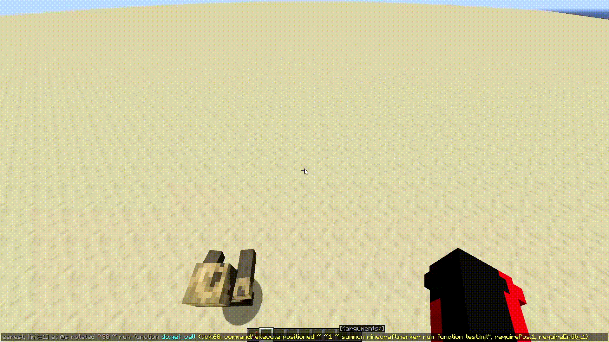

# Сложные примеры использования
В большинстве случаев, при вызове `dc:get_call` в **command** используется не конкретная команда, а целая функция, в которой выполняется какая-либо логика. А еще ведь можно использовать макросы для более гибких систем.

___
### 1. Raycast с задержкой
Рассмотрим функцию `init.mcfunction`, которая является инициализацией для raycast'a.
```mcfunction
tellraw @a [{"text":"Функцию выполняет: ", "color":"aqua"},{"selector":"@s"}]
scoreboard players set @s Raycast 0

function test:loop

kill @s
```
`loop.mcfunction`:
```mcfunction
scoreboard players add @s Raycast 1

particle minecraft:wax_on ~ ~ ~ 0 0 0 0 1 force

execute if score @s Raycast matches ..30 positioned ^ ^ ^0.5 run return run function test:loop
setblock ~ ~ ~ sandstone
```
Для первого теста пропишем в чате запрос на выполнение через время: 
```mcfunction
function dc:get_call {tick:60, command:"execute positioned ~ ~1 ~ summon minecraft:marker run function test:init", requirePos:0, requireEntity:1}
```
Через 3 секунды, на актуальной позиции игрока запустится рейкаст:


___

Теперь меняем 1 параметр в команде (requirePos ставим значение 1/true): 
```mcfunction
execute as @a run function dc:get_call {tick:60, command:"execute positioned ~ ~1 ~ summon minecraft:marker run function test:init", requirePos:1, requireEntity:1}
```

Если не двигаться, то на первый взгляд ничего не поменялось, но стоит запустить команду и немного отойти, как сразу будет заметно, что рейкаст запустился из места вызова `dc:get_call`.

___

Немного усложняем. Перед `function` подвинем немного взгляд и посмотрим на результат: 
```mcfunction
execute rotated ~30 ~ run function dc:get_call {tick:30, command:"execute positioned ~ ~1 ~ summon minecraft:marker run function test:init", requirePos:1, requireEntity:1}
```


Как мы видим, рейкаст запустился правее на 30 градусов. Соответственно, если мы отойдем, то он запустится на месте вызова `dc:get_call`.

___

#### Пример с сущностью

```mcfunction
execute as @e[type=minecraft:husk, sort=nearest, limit=1] at @s rotated ~30 ~ run function dc:get_call {tick:60, command:"execute positioned ~ ~1 ~ summon minecraft:marker run function test:init", requirePos:1, requireEntity:1}
```
Так как у нас установлено значение `requireEntity:true`, то для выполнение команды важно присутсвие сущности:


___

Соответсвенно, если сущность погибает, то команда не выполнится никогда. Но, если сущность вне зоны прогрузки, то алгоритм будет ждать её появления.
___

#### Пример с игроком
```mcfunction
execute as MG_MAKER at @s rotated ~30 ~ run function dc:get_call {tick:60, command:"execute positioned ~ ~1 ~ summon minecraft:marker run function test:init", requirePos:1, requireEntity:1}
```
А если же игрок выйдет с сервера, а потом зайдет обратно, то рейкаст снова запустится:


___
### 2. КД на нажатие ПКМ
Рассмотрим достижение:
```json
{
  "criteria": {
    "e": {
      "trigger": "minecraft:using_item",
      "conditions": {
        "item": {
          "items": "minecraft:structure_block",
          "components": {
            "minecraft:custom_data": {
              "id": "lightning_charge"
            }
          }
        }
      }
    }
  },
  "rewards": {
    "function": "dsb:events/lighting_charge/start"
  }
}
```
И прилегающую к нему функцию:
```mcfunction
function dc:get_call {tick:10, command:"advancement revoke @s only dsb:events/use/lighting_charge", requirePos:false, requireEntity:true}
say использовал!

execute if entity @s[tag=ReloadLightning_charge] run return run title @s actionbar {"translate":"dsb.events.lighting_bolt_cooldown","color":"gold"}

#Перезарядка
tag @s add ReloadLightning_charge
function dc:get_call {tick:600, command:"tag @s remove ReloadLightning_charge", requirePos:false, requireEntity:true}

#прочая логика...
```


Мы можем наблюдать сразу несколько использований `dc:get_call` в одном примере.
___
Первый момент - это конечно же, указанное в названии, **"КД на нажатие ПКМ"**. Достижение срабатывает при нажатии ПКМ по предмету. И внутри функции, привычнее было бы сразу же забирать достижение. Почему же тут используется dc:get_call?

Ответ простой. Если же мы сразу будем забирать достижение у игрока, то есть риск того, что функция сработает несколько раз из-за того, что игрока продержит ПКМ дольше, чем 1 тик (так и случится в 90% случаев).

Так вот, чтобы избежать многократного повтора, достижение проще всего забирать у игрока не в этот же тик. Именно здесь помогает отложенная команда `advancement revoke @s only dsb:events/use/lighting_charge`. Мы указываем, что через полсекунды сработает команда, и самое главное - `requireEntity:true`. Этим параметром мы говорим, что для выполнения команды нужна именна сущность (игрок), от её лица будет выполняться команда, поэтому и указывается селектор `@s` в `command`!

Я зажал ПКМ, но, как мы видим, сообщение ***`использовал`*** пишется в чате каждые 0.5 секунд, вместо 20-и раз в секунду (так как установлено кд 10 тиков).
___
И сразу ниже второй пример использования `dc:get_call`. Это задержка перед использованием предмета, проще говоря перезарядка.

При первом вызове функции игроку дается тег `ReloadLightning_charge` и сразу же вызываем отложенную команду `tag @s remove ReloadLightning_charge` через 30 секунд на удаление тега.

Соответственно, при следующем использовании данного предмета, сначала проверится есть ли на игроке данный тег. Если он присутствует, то ему будет выведено сообщение о том, что нужно еще подождать некоторое время. При помощи конструкции `return run` после вывода сообщения через `title` мы завершаем функцию.
___
### 3. Макросы и цикл с разной задержкой между итерациями

Для следующего примера взял фрагмент кода из обновления Divinity SkyBlock'a.

Для начала основная main функция:
```mcfunction
#Определяем время для следующего вопроса
data modify storage dsb:cts Temp set value {}

###Рассчитываем время для следующего задания
execute store result storage dsb:cts Temp.time int 1 run random value 1100..3200 dsb:get_time_for_l.task
###
function dsb:constructions/small_library/task/work/delay with storage dsb:cts Temp


#Если нет игроков, то ничего не делаем
execute unless entity @p[distance=..3] run return 0

###Иначе берем случайную точку из доступных
function dc:gu/generate

#...
#прочая логика
```
И функция `delay`:
```mcfunction
$function dc:get_call {tick:$(time), command:"function dsb:constructions/small_library/task/work/main", requirePos:false, requireEntity:true}
```
Что здесь первое бросается в глаза? Конечно же: не заданное время `time` при вызове `dc:get_call`. Всё потому что используется макрос.

В первой функции мы рассчитываем время в тиках при помощи `random`. Вообще в оригинале тут еще много параметров, но я упростил пример для понимания. Записываем время в хранилище и вызываем функцию `delay` с использованием нашего хранилища.

Ну и соответсвенно время будет псевдослучайным, и итерации будут работать с разным интервалом.
___
Конечно же, макросы могут быть использованы и для изменения самой выполняемой команды `command`. 

Например, можно запустить get_call в режиме "blank launch", то есть с параметрами `requirePos:false` и `requireEntity:false`, при этом в `command` указать макрос на UUID сущности, которое мы находим в другой функции.
```mcfunction
$function dc:get_call {tick:300, command:"execute as $(UUID) run function my:test", requirePos:false, requireEntity:false}
```